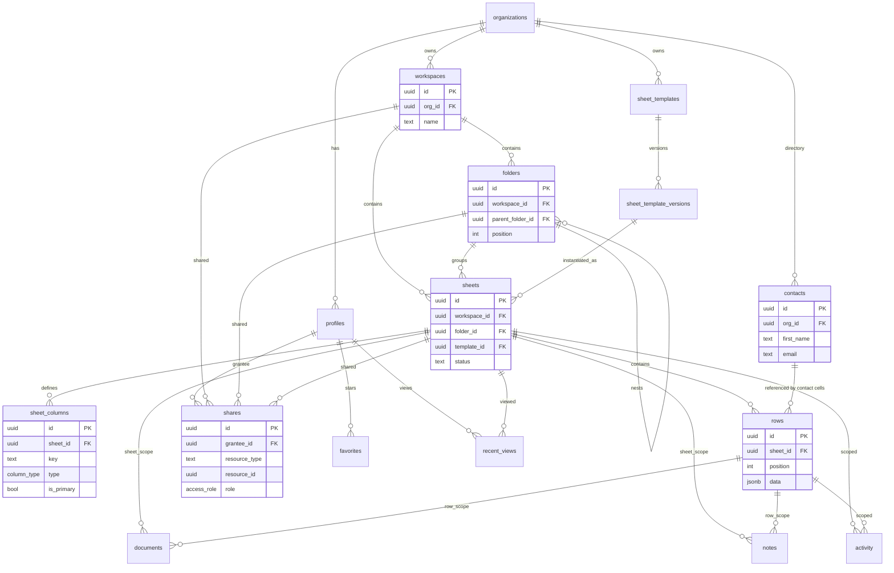

# DrainSheets — G1 Native Architecture (Authoritative Re-Baseline)

**Status:** Definitive target architecture. Replaces the CRM-era schema and the Expand→Migrate→Contract plan.
**Premise:** Greenfield. No users, no data, no linked remote, no migration obligations. We design the architecture we would build **if we started DrainSheets today as a 1:1 Smartsheet replacement for CRE brokers.**
**Optimizing for:** architectural correctness · long-term maintainability · Smartsheet parity · developer velocity. **Not** for: backward compatibility, zero-downtime, CRM-era decisions, existing fixtures.

**Canonical mental model:** `Organization → Workspace → Folder* → Sheet → Row → Cell(by Column)`. Everything else (attachments, notes, activity, shares, favorites) hangs off **Sheet** and/or **Row**. The CRM (Property/Prospect/Contact) is gone as schema and survives only as **templates** and an **org contact directory**.

---

## 1. Final Native Data Model

### 1.1 Keep / New / Delete

**KEEP (generalized & re-keyed to the sheet model):**
`organizations`, `profiles`, `sheets`, `sheet_columns`, `rows`, `documents`, `notes`, `activity`, `favorites`, `recent_views`, `email_logs`, `invitations`, `contacts` (redesigned as an **org-level contact directory**).

**NEW:**
`workspaces`, `folders`, `shares` (unified resource sharing), `sheet_templates`, `sheet_template_versions`.

**DELETE entirely (tables):**
`properties`, `prospects`, `property_assignments`, `sheet_assignments`.

**DELETE (enums):** `prospect_status`, `property_status` (status becomes a `select` column config; sheet lifecycle uses `sheet_status` which already exists).

**DELETE (helper functions):** `can_access_property`, `property_id_for_prospect`, `property_id_for_contact`, `validate_prospect_property_match`, and the storage path helper variant keyed to `property_id`.

**DELETE (triggers — the entire scaffolding zoo from migs 25/27):** `sync_*_sheet_row_ids`, `sync_*_sheet_id`, `sync_contact_row_id`, `sync_sheet_assignment_from_property`, `provision_sheet_from_property`, `provision_row_from_prospect`, all `validate_*_sheet_integrity` equality guards (`sheet_id = property_id`), and `provision_prospect_list_columns` (its payload moves into a system template).

**DELETE (columns):** every `property_id` / `prospect_id` on `documents`, `notes`, `activity`, `favorites`, `recent_views`, `email_logs`, `contacts`. Drop `sheets.address/city/state` (CRM leftovers — addresses are *row data* in CRE sheets, e.g. the Deal Tracker template). Drop dual-path RLS predicates.

---

### 1.2 Table specifications

Conventions: all tables carry `id UUID PK DEFAULT gen_random_uuid()`, `created_at`/`updated_at TIMESTAMPTZ` (with `set_updated_at` trigger where mutable). All carry `org_id` for tenant isolation unless noted. RLS enabled on every table.

#### `organizations` — *keep, unchanged*
- **Purpose:** tenant root.
- **Columns:** `id`, `name`, `created_at`.
- **RLS:** SELECT `is_org_member(id)`; UPDATE `org_role >= owner`.

#### `profiles` — *keep, unchanged*
- **Purpose:** a user within an org (extends `auth.users`). Holds **org role** (administration), distinct from per-resource **access role** (content).
- **Columns:** `id` (=auth.users), `org_id`, `name`, `email`, `role public.org_role` (`owner|admin|editor`), `status` (`active|invited|disabled`), timestamps.
- **Indexes:** `(org_id)`, `(email)`.
- **RLS:** SELECT same-org; UPDATE self (name) / owner (role,status).
- *Note:* `user_role` enum is renamed conceptually to **`org_role`** to disambiguate from content `access_role`. Owners/Admins are org administrators with implicit access to all content; Editors get content **only via shares**.

#### `workspaces` — *new*
- **Purpose:** top-level container brokers organize around (e.g., "A-TEAM Master INFO").
- **Columns:** `id`, `org_id`, `name`, `color` TEXT NULL, `icon` TEXT NULL, `created_by`, timestamps.
- **Relationships:** `org_id → organizations`. Owns folders and sheets.
- **Indexes:** `(org_id, name)`.
- **RLS:** SELECT `can_access_workspace(id)`; INSERT org member with `org_role >= admin` OR any member (decide per product — default: admin+); UPDATE/DELETE via effective role `admin+` on the workspace.

#### `folders` — *new, nestable*
- **Purpose:** optional grouping inside a workspace; **nesting supported** (`parent_folder_id` self-ref), matching Smartsheet.
- **Columns:** `id`, `org_id`, `workspace_id`, `parent_folder_id UUID NULL → folders(id)`, `name`, `position INTEGER`, `created_by`, timestamps.
- **Constraints:** `parent_folder_id` must share `workspace_id` (trigger or app-enforced); guard against cycles (depth cap, e.g. 8).
- **Indexes:** `(workspace_id, parent_folder_id, position)`.
- **RLS:** SELECT `can_access_folder(id)` (which walks to workspace); writes via effective `admin+`.

#### `sheets` — *keep (from mig 22), re-homed*
- **Purpose:** a grid with its own typed columns. The unit a broker "opens."
- **Columns:** `id`, `org_id`, `workspace_id UUID NOT NULL → workspaces`, `folder_id UUID NULL → folders`, `name`, `description`, `status public.sheet_status` (`active|archived`), `template_id UUID NULL → sheet_templates`, `template_version INTEGER NULL`, `position INTEGER`, `created_by`, timestamps, `search_vector` (GENERATED from `name`).
- **Removed vs mig 22:** `address/city/state` (CRM leftovers).
- **Relationships:** belongs to a workspace; optionally inside a folder (folder optional → sheets can sit at workspace root). Owns columns, rows, documents, notes.
- **Indexes:** `(workspace_id, folder_id, position)`, `(org_id, status)`, `gin(search_vector)`.
- **RLS:** SELECT `can_access_sheet(id)`; INSERT effective `editor+` on the parent workspace/folder; UPDATE effective `editor+`; DELETE/archive effective `admin+`.

#### `sheet_columns` — *keep, unchanged from mig 22*
- **Purpose:** the typed schema of a sheet.
- **Columns:** `id`, `sheet_id`, `org_id`, `key`, `label`, `type public.column_type`, `position`, `width`, `is_primary`, `is_pinned`, `config JSONB`, timestamps.
- **`column_type`:** `text · long_text · number · currency · date · url · email · phone · select · checkbox · contact`. (`contact` value = a `contacts.id` reference, see §1.3.)
- **Constraints:** `UNIQUE(sheet_id, key)`; partial-unique one `is_primary` per sheet.
- **Indexes:** `(sheet_id, position)`.
- **RLS:** mirror sheet; schema edits by effective `editor+` (configurable to `admin+`).

#### `rows` — *keep, unchanged from mig 22*
- **Purpose:** a record in a sheet. Cell values in `data JSONB` keyed by `sheet_columns.key`.
- **Columns:** `id`, `sheet_id`, `org_id`, `position INTEGER`, `data JSONB`, `created_by`, timestamps, `search_vector` (GENERATED `jsonb_to_tsvector('english', data, '["string"]')`).
- **Indexes:** `(sheet_id, position)`, `gin(data jsonb_path_ops)`, `gin(search_vector)`.
- **RLS:** all ops `can_access_sheet(sheet_id)`; write requires effective `editor+`; (commenter may write **notes** but not rows).

#### `contacts` — *keep, redesigned as org-level contact directory*
- **Purpose:** reusable people records that `contact`-type columns reference (Smartsheet-accurate: contacts are org objects, not row children). **No longer tied to a prospect/row.**
- **Columns:** `id`, `org_id`, `first_name`, `last_name`, `email`, `phone`, `title`, `company`, `created_by`, `updated_by`, timestamps, `search_vector` (GENERATED).
- **Removed:** `prospect_id`, `row_id`.
- **Indexes:** `(org_id)`, `(email)`, `gin(search_vector)`.
- **RLS:** SELECT same-org (directory is org-visible); INSERT/UPDATE `editor+` (org); DELETE `admin+`.
- *Brokers who want a contact **grid** use the "Contact Database" sheet template (plain rows). The directory powers `contact` columns across all sheets.*

#### `documents` — *keep, re-keyed*
- **Purpose:** files attached at **sheet or row** scope.
- **Columns:** `id`, `org_id`, `sheet_id NOT NULL → sheets`, `row_id NULL → rows`, `file_name`, `file_path`, `mime_type`, `file_size`, `uploaded_by`, `created_at`, `description TEXT NULL` (the Smartsheet attachment description), `search_vector` (GENERATED from file_name).
- **Storage path:** `{org_id}/{sheet_id}/{document_id}_{filename}` (sheet-keyed).
- **Indexes:** `(sheet_id)`, `(row_id)`, `gin(search_vector)`.
- **RLS:** SELECT/INSERT `can_access_sheet(sheet_id)`; DELETE effective `admin+` OR `uploaded_by = self`. Row⊂sheet ownership enforced by a constraint trigger.

#### `notes` — *keep, re-keyed*
- **Purpose:** comments/notes at **sheet or row** scope.
- **Columns:** `id`, `org_id`, `sheet_id NOT NULL`, `row_id NULL`, `user_id`, `content`, timestamps, `search_vector`.
- **Indexes:** `(sheet_id)`, `(row_id)`, `gin(search_vector)`.
- **RLS:** SELECT `can_access_sheet`; INSERT effective `commenter+` AND `user_id = self`; UPDATE/DELETE `admin+` OR author.

#### `activity` — *keep, re-keyed; sheet/row-grained, hierarchy-queryable*
- **Purpose:** append-only audit; one table feeds global / workspace / sheet / row timelines.
- **Columns:** `id`, `org_id`, `actor_id`, `workspace_id NULL`, `sheet_id NULL`, `row_id NULL`, `entity_type`, `entity_id`, `action`, `metadata JSONB`, `created_at`.
- **Indexes:** `(org_id, created_at DESC)`, `(sheet_id, created_at DESC)`, `(row_id, created_at DESC)`, `(workspace_id, created_at DESC)`.
- **RLS:** SELECT org member AND (`sheet_id IS NULL` OR `can_access_sheet(sheet_id)` OR `admin+`); INSERT server/trigger only.

#### `favorites` — *keep, polymorphic*
- **Purpose:** user-starred items.
- **Columns:** `id`, `user_id`, `org_id`, `target_type` (`sheet|workspace|folder`), `target_id`, `created_at`, `UNIQUE(user_id, target_type, target_id)`.
- **RLS:** SELECT/INSERT/DELETE `user_id = self` AND can-access the target.

#### `recent_views` — *keep, sheet-focused*
- **Purpose:** "Recents" landing.
- **Columns:** `id`, `user_id`, `org_id`, `sheet_id`, `viewed_at`, `UNIQUE(user_id, sheet_id)`.
- **RLS:** `user_id = self` AND `can_access_sheet(sheet_id)`.

#### `email_logs` — *keep, re-keyed*
- **Purpose:** audit of "Quick Update" sends.
- **Columns:** `id`, `org_id`, `sheet_id NULL`, `row_id NULL`, `sent_by`, `to_addresses[]`, `cc_addresses[]`, `subject`, `message`, `included_fields JSONB`, `attachment_ids[]`, `layout`, `resend_id`, `status`, `error_message`, `created_at`.
- **RLS:** SELECT org member AND sheet-accessible; INSERT `sent_by = self`.

#### `invitations` — *keep, unchanged*
- Owner-only invite flow. (Unaffected by the sheet re-baseline.)

#### `shares` — *new, unified sharing* (see §5)
#### `sheet_templates` / `sheet_template_versions` — *new* (see §4)

---

## 2. Final ERD

**Narrative:** A single hierarchy (`workspace → folder* → sheet → row`) with sheet/row-scoped attachments, notes, and activity; an org-level contact directory referenced by `contact` columns; a versioned template system that instantiates sheets; and one polymorphic `shares` table covering workspace/folder/sheet sharing. No CRM tables, no compatibility columns, no scaffolding triggers.

---

## 3. Workspace / Folder / Sheet Architecture

Decisions (designed as the **permanent** model):

- **Workspaces own everything.** Every sheet and folder belongs to exactly one workspace (`workspace_id NOT NULL`). The workspace is the unit of broad sharing and the top of the Browse tree.
- **Folders are nestable.** `folders.parent_folder_id` self-references; a folder tree lives under one workspace. Depth-capped (8) with cycle prevention. This matches the broker video ("A-TEAM Master INFO → A-Team Franchisee Pipeline → …").
- **Sheets may live directly under a workspace OR inside a folder.** `sheets.folder_id` is nullable. (Smartsheet allows both; do not force a folder.)
- **No sheet exists outside a workspace.** There is no orphan/global sheet. New users get a default "My Workspace."
- **Ordering** via `position` on folders and sheets for manual arrangement in the tree.

**Why not flatten?** The CRE workflow is hierarchy-first (brokers navigate trees and share whole workspaces with a team). A flat list breaks at 30–50 sheets and cannot express team-level sharing. Hierarchy is identity here.

---

## 4. Template Architecture

The CRM concepts become **templates, not schema.**

**Decision: all three kinds, one mechanism.** Templates are **database entities** with two scopes seeded the same way:
- **System templates** (`scope = 'system'`, `org_id NULL`): seeded, read-only, version-controlled. CRE seeds: **Tenant Prospect List**, **Deal Tracker** (Address, Purchase Price, PPSF, NNN, Stage), **Contact Database**.
- **Org/User templates** (`scope = 'org' | 'user'`): created by brokers via "Save sheet as template."

#### `sheet_templates`
- **Columns:** `id`, `org_id NULL` (NULL = system), `scope` (`system|org|user`), `key TEXT` (stable slug for system), `name`, `description`, `created_by NULL`, `current_version INTEGER`, timestamps.
- **RLS:** system templates readable by all authenticated; org templates by org members; user templates by creator (+ optionally shareable later).

#### `sheet_template_versions`
- **Columns:** `id`, `template_id`, `version INTEGER`, `columns JSONB` (snapshot: ordered array of `{key,label,type,position,is_primary,is_pinned,config}`), `seed_rows JSONB NULL` (optional example rows), `created_at`, `UNIQUE(template_id, version)`.
- **Versioning:** immutable snapshots. Editing a template creates `version = current_version + 1` and bumps `sheet_templates.current_version`. Sheets record which `template_id` + `template_version` they were created from (provenance; no live coupling — a sheet's columns are owned by the sheet after creation).

#### Create-from-template flow
1. User picks a template (system/org/user) + version (default: current).
2. Create `sheet` (in chosen workspace/folder) with `template_id`/`template_version`.
3. Copy the version's `columns` JSONB into `sheet_columns` rows.
4. Optionally insert `seed_rows` into `rows`.
5. Blank sheet = the implicit "Blank" template (one primary `text` column).

This is exactly where the old `provision_prospect_list_columns` payload goes — relocated from a trigger into the **Tenant Prospect List** system template seed.

---

## 5. Final Sharing Model

**Single unified `shares` table** replaces `property_assignments` and `sheet_assignments`.

#### `access_role` enum (content roles, ordered)
`viewer (1) < commenter (2) < editor (3) < admin (4) < owner (5)`
- **viewer** — read sheet + rows + attachments.
- **commenter** — viewer + add notes/comments.
- **editor** — commenter + edit rows/cells + add columns + upload.
- **admin** — editor + manage sheet (rename, archive, share, manage columns/structure).
- **owner** — admin + delete + transfer ownership.

`org_role` (on `profiles`, `owner|admin|editor`) is **separate** and governs org administration (invite users, billing, see-all). Org **owner/admin → implicit `admin`** on all content org-wide. Org **editor → content only via shares.**

#### `shares`
- **Columns:** `id`, `org_id`, `grantee_id → profiles` (later extensible to groups), `resource_type` (`workspace|folder|sheet`), `resource_id`, `role access_role`, `created_by`, `created_at`, `UNIQUE(grantee_id, resource_type, resource_id)`.
- **RLS:** SELECT by org admins and the grantee; INSERT/DELETE requires effective `admin+` on the resource (you can only share what you administer).

#### Inheritance rules
- **Top-down inheritance.** A share on a **workspace** applies to all its folders and sheets; a share on a **folder** applies to all sheets within (including nested folders). A share on a **sheet** applies to that sheet only.
- **Effective role = MAX** of all applicable grants (sheet, its folder chain, its workspace) plus the org-admin implicit `admin`. Most-permissive wins (Smartsheet semantics).
- **Resolution helper** `effective_role_for_sheet(sheet_id, user)` walks: org-admin? → `admin`; else `MAX(role)` over shares on {sheet, each ancestor folder, workspace}. `can_access_sheet(id)` = `effective_role_for_sheet(...) >= viewer`. Analogous `can_access_workspace` / `can_access_folder`.
- **No CRM assignment logic.** `property_assignments` ("editor assigned to a property") is fully replaced by `shares` at `editor` on a sheet/folder/workspace — a strict generalization.

RLS across all content tables routes through `effective_role_for_sheet` thresholds (e.g., row UPDATE requires `>= editor`, sheet archive requires `>= admin`, note INSERT requires `>= commenter`).

---

## 6. Search Architecture

**Entities searched:** `sheets`, `rows`, `contacts`, `documents`, `notes`. (Restores notes, which the mig-26 rewrite dropped.)

- **Indexing:** generated `tsvector` columns + GIN on each (already the pattern). `rows` indexes its JSONB string values via `jsonb_to_tsvector`. Contacts index name/email/company.
- **RPC:** `search_global(query, limit, offset)` returns `(entity_type, entity_id, title, sheet_id, workspace_id, rank)`. `SECURITY DEFINER`, org-scoped, every branch filtered by `can_access_sheet` (or org-visibility for contacts).
- **Result types:** `sheet` (title=name), `row` (title=primary-column value, plus its `sheet_id` for linking), `contact` (title=full name), `document` (title=file_name, links to its sheet/row), `note` (title=snippet, links to sheet/row).
- **Ranking:** `ts_rank` with light boosts: sheet-name and row-primary-column matches rank above body/note matches; recency tiebreaker via `created_at`. Tune later, but rank in SQL, not the client.
- **Why these entities:** brokers search to *navigate to a sheet*, *find a tenant/deal row*, *find a person*, or *find a document/OM*. All five map to a real "take me there" intent; nothing else in the model is a meaningful search target.

---

## 7. Attachments / Notes / Activity Ownership

**Attachments → Sheet OR Row (both supported; row optional).**
`documents.sheet_id NOT NULL`, `row_id NULL`. This is exactly the Smartsheet `Row / Sheet / All` model the existing panel already speaks. A constraint trigger enforces `row.sheet_id = document.sheet_id` when `row_id` is set. (Cell-level attachments are explicitly out — no observed need; the JSONB decision already rejected cell granularity.)

**Notes → Sheet OR Row (both; row optional).**
Same shape as documents. Row notes are the "row discussion/comments" brokers use; sheet notes are general. (Future: optional `column_id` for cell comments — not now.)

**Activity → recorded at the finest grain (row/sheet), queryable up the hierarchy.**
One `activity` table with nullable `workspace_id`/`sheet_id`/`row_id`. A single write records the most specific scope; feeds are produced by querying at the desired level (row timeline, sheet timeline, workspace timeline, org feed) via the indexes. **Do not** split activity into per-level tables — one append-only log with scope columns is cleaner, cheaper, and matches how the dashboard + row detail both need it.

---

## 8. Import Architecture (native)

Import is a **first-class sheet-creation path**, no CRM constraints.

**Two modes:**

1. **Template-based import.** Pick a system/org/user template → its columns are fixed → upload CSV/XLSX → map source columns to template columns → preview + dedupe → create sheet (from template) → insert rows. (This is how a broker imports a Smartsheet "Tenant Prospects" export into the Tenant Prospect List template.)

2. **Freeform import.** Upload CSV/XLSX → **infer columns from the header row** with type detection (number/currency/date/url/email/phone/select/text) → user reviews/edits inferred `sheet_columns` (rename, retype, set primary) → create a brand-new sheet with those columns → insert rows. (This is how an arbitrary Smartsheet sheet comes across without a template.)

**Mechanics:**
- Import targets a chosen **workspace/folder**.
- Creates exactly one sheet, its `sheet_columns`, and N `rows` (`data` keyed by column `key`), in a transaction.
- **Dedupe** operates on `rows.data` (configurable key column, e.g. primary column) within the target sheet.
- Contact columns map emails to existing `contacts` (directory) or create new contact records.
- Reuses the existing parser/mapping/preview UI (`lib/import/*`, `components/import/*`), re-pointed from "insert prospects" to "create sheet + columns + rows."

---

## 9. Migration History Strategy — **Option A: Squash / Re-Baseline**

**Decision: squash the migration history into a clean native baseline.** Delete migrations that create CRM tables and all scaffolding; author the native schema as the foundation.

**Defense:**
- **No data, no environments, no remote** → migration history has **zero operational value**; it is purely developer documentation. There is nothing to "migrate."
- **Maintainability is an explicit top priority.** Collapse-forward (Option B) leaves permanent archaeology — `properties` created in mig 2, dropped in a teardown mig; RLS as stacked CREATE/DROP layers; trigger functions defined then dropped. Every future engineer must read 28+ migrations to understand a schema that *could* be ~10 clean files.
- **Velocity:** a squashed baseline makes `db:reset` apply a coherent native schema; new contributors read the real model, not its history.
- **The only thing Option B preserves — linear history continuity — protects nothing here** (no deployed DB depends on it).

**Practical shape:** a small native migration set, e.g.:
`0001_extensions_enums` (incl. `org_role`, `access_role`, `column_type`, `sheet_status`) ·
`0002_org_profiles` · `0003_workspaces_folders` · `0004_sheets_columns_rows` · `0005_contacts_directory` · `0006_documents_notes_activity` · `0007_favorites_recents_email_logs` · `0008_shares` · `0009_templates` · `0010_rls_and_search` · `0011_invitations`.
Reuse migrations 22/23 nearly verbatim inside `0004`/`0010`. Everything CRM and all of 24–27's scaffolding simply never exists.

---

## 10. Implementation Plan (authoritative roadmap: Mig-27 state → native)

Effort = ideal engineering-days, one senior full-stack dev. Reads `db:reset`-driven; no data steps.

### Phase G1 — Schema re-baseline (squash)
- **Objective:** Replace the migration set with the native baseline (§1, §3, §4, §5). Delete CRM tables, scaffolding triggers, dual-path RLS, legacy helpers/columns. Author `workspaces`, `folders`, `shares`, `templates` natively.
- **Files:** `supabase/migrations/*` (squashed to ~11 native files), `supabase/seed.sql`.
- **Effort:** 3–5 days.
- **Dependencies:** none.
- **Risks:** Low (no data). Main risk is RLS-helper correctness for hierarchy/inheritance — covered by tests in G6.

### Phase G2 — Access model & RLS helpers
- **Objective:** `org_role`/`access_role`; `effective_role_for_sheet`, `can_access_sheet/workspace/folder`; share-resolution with inheritance; RLS on all tables routed through effective role.
- **Files:** migration `0010_rls_and_search`, `lib/permissions/*` (rewrite property→sheet/workspace; add role helpers).
- **Effort:** 3–5 days.
- **Dependencies:** G1.
- **Risks:** Medium — inheritance + most-permissive-wins must be exhaustively tested (G6). Recursion on nested folders needs a bounded CTE.

### Phase G3 — Templates + seed system templates
- **Objective:** `sheet_templates`/`sheet_template_versions`; seed **Tenant Prospect List**, **Deal Tracker**, **Contact Database**, **Blank**; create-from-template action.
- **Files:** migration `0009_templates`, `actions/templates.ts`, `scripts/seed-beta.ts` (rewrite), seed SQL.
- **Effort:** 2–3 days.
- **Dependencies:** G1.
- **Risks:** Low.

### Phase G4 — Server actions (native CRUD, read + write)
- **Objective:** `actions/workspaces.ts`, `folders.ts`, `sheets.ts`, `rows.ts`, `columns.ts`, `shares.ts`, `templates.ts`. Re-point `documents/notes/activity/favorites/recents/email/search/import/dashboard` to sheet/row/contact-directory. **Delete** `properties.ts`/`prospects.ts`/`assignments.ts`.
- **Files:** `src/actions/*`, `lib/validations/*` (sheet/row/column schemas), `lib/search/format.ts`.
- **Effort:** 5–8 days.
- **Dependencies:** G1–G3.
- **Risks:** Medium (breadth). Single coherent branch acceptable (greenfield); optionally split PRs by surface.

### Phase G5 — UI cutover (Browse tree + data-driven grid + panels)
- **Objective:** Workspace/folder **Browse tree** nav; `property-detail-view → sheet-view`; `property-prospects-grid → data-driven grid` (render from `sheet_columns` + `rows.data`, cell renderers per type, `contact` from directory); attachments/notes/activity panels on sheet/row; share dialog on `shares` with role picker + Viewer/Commenter; create-from-template + import entry points; search results for sheet/row/contact/document/note.
- **Files:** `components/layout/*` (rail→tree), `components/data/*` (grid + `cell-renderers/*`), `components/properties/* → components/sheets/*`, `attachments-panel`, `notes/*`, `search/*`, `import/*`, `email/*`, `recents/*`, navigation.
- **Effort:** 6–9 days.
- **Dependencies:** G4.
- **Risks:** Medium-High (largest UI surface; the grid + tree are core). Inline cell editing now unblocked (no guard triggers) — can land here or as immediate S1-1.

### Phase G6 — Tests, seed, perf, types
- **Objective:** Rewrite RLS integration suite for sheets/columns/rows/shares/workspaces/folders incl. **inheritance + most-permissive-wins + editor isolation**; rewrite `seed-beta.ts`, `integrity-check.ts`, `perf-benchmark.ts`; regenerate `types/database.ts`; `typecheck/lint/build` green.
- **Files:** `tests/**`, `scripts/**`, `types/*`.
- **Effort:** 3–4 days.
- **Dependencies:** G1–G5.
- **Risks:** Medium — inheritance test matrix is the critical correctness gate.

**Total: ~22–34 days** to a clean native Smartsheet-style architecture with workspaces, folders, templates, unified sharing, and a data-driven grid — and it lands inline-editing groundwork (S1-1) for free.

**Sequence:** G1 → G2 → G3 → G4 → G5 → G6. G2 and G3 can overlap after G1; G6 runs continuously and gates merge.

### Cross-walk: CRM concept → native home
| CRM-era | Native |
|---|---|
| Property | **Sheet** (Tenant Prospect List / Deal Tracker template) |
| Prospect | **Row** |
| Property fields (address/price/NNN) | **Columns** (template-defined) |
| prospect_status enum | `select` **column config** |
| Contact (per-prospect) | **Contact directory** + `contact` column |
| property_assignments | **`shares`** (editor on sheet/folder/workspace) |
| can_access_property | **`can_access_sheet`** via `effective_role_for_sheet` |
| (none) | **Workspaces, Folders, Templates, unified Sharing** |

---

### Authoritative status
This document replaces the CRM-era architecture and the Expand→Migrate→Contract cutover plan as the definitive S0-1 target. Prior audits (`PRODUCT_AUDIT`, `RE_AUDIT`, `S0-1_SHEET_ENGINE_DESIGN`, `S0-1_CUTOVER_PLAN`, `S0-1_GREENFIELD_REAUDIT`) remain as decision history; where they conflict with this file, **this file wins.**
