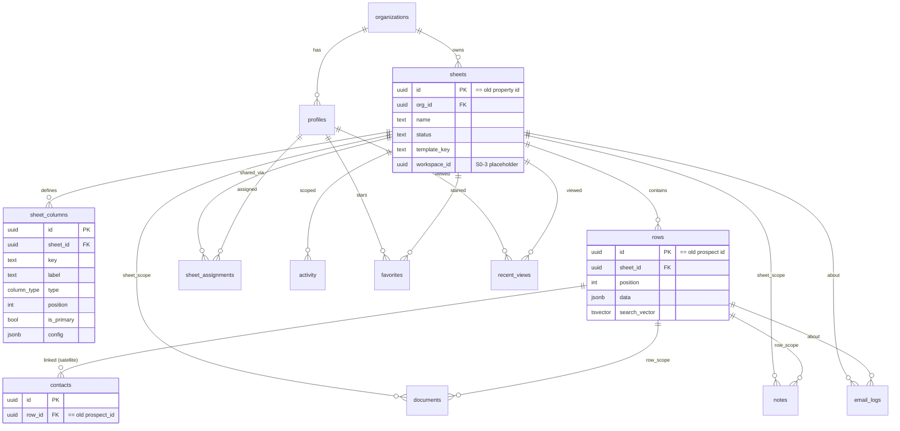

# S0-1 — First-Class Sheet + Column Engine — Technical Design Document

**Status:** Design (pre-implementation). No code in this document.
**Scope:** S0-1 only, from `RE_AUDIT_Smartsheet_Replacement.md`. We are following the revised roadmap exactly — no alternative directions, no scope reduction.
**Goal:** Replace the single hard-coded sheet (Property → Prospect grid with fixed columns) with a generic, typed **Sheet + Column + Row** engine, migrating all existing data with zero loss and zero URL breakage.

### In scope (S0-1)
- New core tables: `sheets`, `sheet_columns`, `rows`. Cell storage decision (JSONB vs `row_cells`).
- Re-point dependents to the sheet/row model: `documents`, `notes`, `activity`, `favorites`, `recent_views`, `email_logs`, assignments.
- Data-driven grid rendering of dynamic column types.
- Preserve every existing workflow: attachments panel, preview, email, favorites, recents, sharing, import.

### Explicitly NOT in scope (later roadmap items — do not build here)
- `workspaces` / `folders` / Browse tree → **S0-3**. (We add nullable `workspace_id`/`folder_id` FK *placeholders* on `sheets` so S0-3 is non-breaking, but no workspace logic now.)
- Sheet **templates** as a user feature → **S0-2**. (S0-1 seeds *one* internal "Prospect List" template definition to drive migration; it is not yet a user-facing template system.)
- Inline cell editing → **S1-1**. (S0-1 renders columns dynamically; editing still flows through the existing forms, now writing to `rows.data`.)
- Per-sheet sharing / Viewer role → **S1-2**. (S0-1 keeps the current property/editor-assignment sharing semantics, re-pointed to sheets.)
- Custom/saved views, duplication → **S1-3/S1-4**.

---

## 1. Cell-storage decision: `rows.data JSONB` (recommended) vs `row_cells` (EAV)

**Decision: store cell values in `rows.data JSONB`, with `sheet_columns` providing the typed schema. Do NOT build a `row_cells` EAV table.**

### Justification (grounded in the broker workflow + this codebase)

| Criterion | `rows.data JSONB` | `row_cells` (EAV: one row per cell) |
|-----------|-------------------|--------------------------------------|
| Read a full grid (N rows × M cols) | **1 query, no pivot** — render directly | N×M rows → must pivot/aggregate; heavy |
| Migration from `prospects` | **Trivial** — map 5 fixed fields → JSON keys | Must explode every prospect into M cell rows |
| Atomic row update | **One UPDATE** | M upserts per row edit |
| Code complexity | Low — one row = one record | High — joins, pivots, cell-key plumbing everywhere |
| Matches existing patterns | Yes — `activity.metadata`, `email_logs.included_fields`, `column.config` already JSONB | New paradigm in this codebase |
| Full-text search | Generated `tsvector` from `jsonb_to_tsvector` + GIN | Per-cell index, more moving parts |
| Per-**cell** metadata (cell comments, cell formatting, cell history) | Weaker (would need side table) | Stronger |
| RLS granularity | Row/Sheet level (which is exactly what we need) | Cell level (which we do **not** need) |

**Why this is the right call for *this* product:** The broker video shows attachments, notes/comments, and sharing scoped at the **Row** and **Sheet** level — never at the cell level. Smartsheet's own row-detail model (and our already-built `attachments-panel` with `Row / Sheet / All` tabs) is **row-centric**, not cell-centric. EAV's only real advantage (per-cell metadata) buys us nothing the observed workflow needs, while imposing a permanent tax on the most common operation (rendering a grid). JSONB keeps reads cheap, migration trivial, and aligns with patterns already in the repo.

**Mitigations for JSONB's weaknesses:**
- **Typing/validation** lives in `sheet_columns.type` + `config`, enforced in the server-action layer (Zod, as today) — not in the DB. Acceptable; the app already centralizes validation in `src/lib/validations/`.
- **Search:** add a generated `search_vector` on `rows` derived from `data` via `jsonb_to_tsvector('english', data, '["string"]')` + GIN index (mirrors the existing generated-column FTS pattern in `…08_search.sql`).
- **Future cell-level needs:** if cell comments/history are ever required, add a narrow `row_cell_meta(row_id, column_key, …)` side table *then* — without rebuilding the value store.

---

## 2. Database architecture

### 2.1 New enum

`column_type` — `text · long_text · number · currency · date · url · email · phone · select · checkbox · contact`

- `select` = single-choice status/category; choices + colors stored in `sheet_columns.config`.
- `contact` = a **linked/derived** column (see §2.6) backed by the preserved `contacts` satellite table, not stored in `rows.data`.

### 2.2 `sheets` (generalizes `properties`)

| Column | Type | Notes |
|--------|------|-------|
| id | uuid PK | **Backfilled with the original `properties.id`** (ID preservation — see §3.1) |
| org_id | uuid NOT NULL → organizations | RESTRICT (as today) |
| name | text NOT NULL | from `properties.name` |
| description | text | from `properties.description` |
| status | `sheet_status` (`active`/`archived`) | reuse/rename of `property_status`; from `properties.status` |
| template_key | text NULL | `'prospect_list'` for migrated sheets (drives default columns; S0-2 will expand) |
| address / city / state | text NULL | **carried over from `properties`** to preserve location pill, import, and search with zero rework (deprecate later) |
| workspace_id | uuid NULL | **placeholder for S0-3**, no FK target yet / nullable FK added in S0-3 |
| folder_id | uuid NULL | placeholder for S0-3 |
| created_by | uuid → profiles (SET NULL) | from `properties.created_by` |
| created_at / updated_at | timestamptz | carried over; `set_updated_at` trigger |
| search_vector | tsvector GENERATED | from `name` (+ address/city/state) — ports `properties` FTS |

Indexes: `(org_id, status)`, `(org_id, name)`, `gin(search_vector)`, `(workspace_id)`, `(folder_id)`.

### 2.3 `sheet_columns` (new)

| Column | Type | Notes |
|--------|------|-------|
| id | uuid PK | |
| sheet_id | uuid NOT NULL → sheets (CASCADE) | |
| org_id | uuid NOT NULL | denormalized for RLS performance (avoids join in policy) |
| key | text NOT NULL | stable slug used as the JSON key in `rows.data` (e.g. `company`, `website`) |
| label | text NOT NULL | display header (e.g. "Tenant/Company") |
| type | `column_type` NOT NULL | |
| position | integer NOT NULL | left-to-right order |
| width | integer NULL | persisted column width |
| is_primary | boolean NOT NULL DEFAULT false | the pinned "name" column (exactly one per sheet) |
| is_pinned | boolean NOT NULL DEFAULT false | frozen columns |
| config | jsonb NOT NULL DEFAULT '{}' | select options/colors, currency code, date format, contact-link flags |
| created_at / updated_at | timestamptz | |

Constraints/indexes: `UNIQUE (sheet_id, key)`, `INDEX (sheet_id, position)`, partial unique on `is_primary = true` per sheet.

### 2.4 `rows` (generalizes `prospects`)

| Column | Type | Notes |
|--------|------|-------|
| id | uuid PK | **Backfilled with original `prospects.id`** (ID preservation) |
| sheet_id | uuid NOT NULL → sheets (CASCADE) | from `prospects.property_id` |
| org_id | uuid NOT NULL | denormalized for RLS |
| position | integer NOT NULL | manual row ordering (Smartsheet rows are ordered) |
| data | jsonb NOT NULL DEFAULT '{}' | cell values keyed by `sheet_columns.key` |
| created_by | uuid → profiles (SET NULL) | |
| created_at / updated_at | timestamptz | `set_updated_at` trigger |
| search_vector | tsvector GENERATED | `jsonb_to_tsvector('english', data, '["string"]')` |

Indexes: `(sheet_id, position)`, `gin(data jsonb_path_ops)`, `gin(search_vector)`.

### 2.5 Re-pointed dependent tables

Each gains sheet/row FKs; legacy columns retained until the contract phase (§4). Because IDs are preserved, backfill is a straight copy.

| Table | Add | Backfill | Keep (legacy, dropped in contract phase) |
|-------|-----|----------|------------------------------------------|
| `documents` | `sheet_id` (NOT NULL→sheets), `row_id` (NULL→rows SET NULL) | `sheet_id = property_id`, `row_id = prospect_id` | `property_id`, `prospect_id` |
| `notes` | `sheet_id`, `row_id` | same | `property_id`, `prospect_id` |
| `activity` | `sheet_id` (NULL→sheets) | `sheet_id = property_id`; new `entity_type` values `sheet`/`row` | `property_id` |
| `favorites` | `sheet_id` (→sheets, UNIQUE(user_id, sheet_id)) | `sheet_id = property_id` | `property_id` |
| `recent_views` | `sheet_id` | `sheet_id = property_id` | `property_id` |
| `email_logs` | `sheet_id`, `row_id` | `sheet_id = property_id`, `row_id = prospect_id` | `property_id`, `prospect_id` |
| `property_assignments` → **`sheet_assignments`** | new table `(sheet_id, user_id)` | copy from `property_assignments` (sheet_id = property_id) | keep `property_assignments` until contract |

### 2.6 `contacts` — kept as a typed satellite (re-pointed)

`contacts` is **not** dissolved into the generic engine in S0-1 (a "Contact Database" sheet is an S0-2 template, separate concern). Instead:

- Add `row_id` (uuid → rows), backfill `row_id = prospect_id` (IDs preserved). Keep `prospect_id` until contract phase.
- A `contact`-type column in `sheet_columns` is a **derived/linked virtual column**: it is *not* stored in `rows.data`. The grid renderer reads the linked `contacts` rows by `row_id` and renders a name/summary cell. This preserves the entire existing contact CRUD/search/import surface untouched.
- Rationale: keeps S0-1 bounded, preserves contact detail (email/phone/title) and `contacts` FTS, and matches the current grid where the "Contact" cell is derived from `contacts`.

### 2.7 RLS strategy

The lynchpin today is `can_access_property(property_id)` (admins/owners org-wide; editors via `property_assignments`). We mirror it for sheets and keep the old function alive during transition.

New helper functions (SECURITY DEFINER, mirroring existing ones):
- `can_access_sheet(check_sheet_id uuid)` — same logic as `can_access_property`, over `sheets` + `sheet_assignments`.
- `sheet_id_for_row(check_row_id uuid)` — like `property_id_for_prospect`.
- `sheet_id_for_contact(check_contact_id uuid)` — via `contacts.row_id → rows.sheet_id`.

Policies (mirror current property/prospect/document/note patterns):
- `sheets`: SELECT `can_access_sheet(id)`; INSERT `has_role('admin') AND org match`; UPDATE `has_role('admin') OR (has_role('editor') AND can_access_sheet(id))`. (Mirrors `properties`.)
- `sheet_columns`: SELECT `can_access_sheet(sheet_id)`; INSERT/UPDATE/DELETE `has_role('admin') OR (has_role('editor') AND can_access_sheet(sheet_id))`. (Schema edits allowed for assigned editors, matching Smartsheet; tighten to admin-only if the team prefers.)
- `rows`: SELECT/INSERT/UPDATE `can_access_sheet(sheet_id)`. (Mirrors `prospects`.) DELETE policy added if/when row delete is enabled (today prospects have no delete).
- `sheet_assignments`: SELECT `has_role('admin')`; INSERT/DELETE `has_role('owner')`. (Mirrors `property_assignments`.)
- Re-pointed tables switch their `USING`/`WITH CHECK` from `can_access_property(property_id)` to `can_access_sheet(sheet_id)` **in the contract phase**; during transition both predicates are OR'd (`can_access_property(property_id) OR can_access_sheet(sheet_id)`) so nothing breaks mid-migration.
- **Storage bucket RLS** (`…09_storage_bucket.sql`) currently authorizes via `can_access_property`. Because `sheet_id = property_id` (ID preservation) and the storage path is unchanged (`{org_id}/{property_id}/…`), **no file moves and no storage-path changes are required**; the storage policy gets an OR'd `can_access_sheet` predicate, then swaps in the contract phase.

### 2.8 Search RPC

`search_global` currently UNIONs properties/prospects/contacts/documents. New version UNIONs **sheets** (was properties, `entity_type='sheet'`) and **rows** (was prospects, `entity_type='row'`, title = primary-column value from `data`), keeping contacts/documents. Returns same shape `(entity_type, entity_id, title, sheet_id, rank)` — `property_id` field renamed to `sheet_id` (or aliased to preserve the column name during transition). Row titles derive from the sheet's `is_primary` column key.

---

## 3. Data migration plan

### 3.1 The core technique: **ID preservation**

Insert each `sheet` with the **same UUID** as its source `property`, and each `row` with the same UUID as its source `prospect`. Consequences:
- Every existing FK (`documents.property_id`, `favorites.property_id`, `email_logs.property_id/prospect_id`, etc.) can be copied verbatim into `sheet_id`/`row_id`.
- Every existing URL (`/properties/{id}`, `/prospects/{id}`) still resolves (route handlers look the id up in the new tables — see §4).
- Storage paths (`{org_id}/{property_id}/…`) remain valid.
- Rollback is simple: new tables are additive until the contract phase.

### 3.2 Per-table plan

| Source | Target | Transformation |
|--------|--------|----------------|
| `properties` | `sheets` | 1:1, same id. `template_key='prospect_list'`. Carry name/description/status/address/city/state/created_by/timestamps. |
| (none) | `sheet_columns` | For each migrated sheet, insert the canonical **Prospect List** column set: `company`(primary,text) · `contact`(contact, derived) · `status`(select; options = current `prospect_status` enum values w/ colors) · `use`/category(text) · `website`(url) · `comments`(long_text). Positions match today's grid order. |
| `prospects` | `rows` | 1:1, same id. `sheet_id = property_id`. `data = { company: company_name, status, use: category, website, comments }`. `position` = row_number over (property_id order by created_at). |
| `contacts` | `contacts` (satellite) | Add `row_id`; set `row_id = prospect_id`. No data change otherwise. |
| `documents` | `documents` | Add `sheet_id=property_id`, `row_id=prospect_id`. Files untouched. |
| `notes` | `notes` | Add `sheet_id=property_id`, `row_id=prospect_id`. |
| `activity` | `activity` | Add `sheet_id=property_id`. Map `entity_type` `property→sheet`, `prospect→row` on read (and backfill where stored). |
| `favorites` | `favorites` | Add `sheet_id=property_id`; new UNIQUE(user_id, sheet_id). |
| `recent_views` | `recent_views` | Add `sheet_id=property_id`. |
| `email_logs` | `email_logs` | Add `sheet_id=property_id`, `row_id=prospect_id`. |
| `property_assignments` | `sheet_assignments` | Copy rows; `sheet_id=property_id`. |

### 3.3 `prospect_status` enum handling

The DB enum `prospect_status` becomes a **`select` column config** (`status` column's `config.options`), not a DB enum, in the migrated sheets. The enum type remains defined (harmless) until the contract phase; the satellite/legacy `prospects.status` is retained read-only during transition. New writes go to `rows.data.status` (validated against `sheet_columns.config`).

### 3.4 Backfill validation (must pass before contract phase)
- `count(sheets) == count(properties)`; `count(rows) == count(prospects)`; id sets identical.
- For every document/note/email_log/favorite/recent_view: `sheet_id` equals former `property_id`, `row_id` equals former `prospect_id`.
- Every `rows.data` contains the keys defined by its sheet's columns; no prospect field dropped.
- `sheet_assignments` row set equals `property_assignments` row set.
- Extend `npm run db:integrity` with these assertions.

---

## 4. Frontend architecture

**Principle: keep server-action *interfaces* stable; swap their *implementations* to read/write the new tables. Routes do not change in S0-1.**

### 4.1 Routes (unchanged in S0-1)
`/properties`, `/properties/[id]`, `/prospects/[id]`, etc. remain. Their data loaders now resolve against `sheets`/`rows` (id-preserved). A later phase (S0-3) introduces `/sheets/[id]` as the canonical route with redirects from `/properties/[id]`; **out of S0-1 scope.**

### 4.2 `property-detail-view.tsx` → `sheet-view.tsx`
`PropertyDetailView` is already the "open sheet" surface (SheetHeader + grid + attachments panel + share/manage/send dialogs + recents tracker). Conversion:
- Inputs change from typed `prospects: ProspectWithProperty[]` to `{ sheet, columns: SheetColumn[], rows: SheetRow[], … }`.
- Keep all wiring: `AttachmentsPanel`, `SendUpdateDialog`, `SharePropertyDialog`, `ManageAccessDialog`, `RecentPropertyTracker`, `useWorkspacePanel`. They take `sheetId`/`rowId` instead of `propertyId`/`prospectId` (same UUIDs).
- `selectedProspectId` → `selectedRowId`; the row-context header reads the primary column value.

### 4.3 `property-prospects-grid.tsx` → data-driven `sheet-grid.tsx`
Today columns are hard-coded JSX (`Company`, `Contact`, `Status`, `Use`, `Website`, `Comments`). New:
- Render headers by iterating `columns` (ordered by `position`, honoring `is_pinned`/`width`).
- Render each row by iterating columns and reading `row.data[column.key]` (or the linked `contacts` for `contact`-type).
- Reuse the existing presentational primitives in `data/smartsheet-grid.tsx` and `data/grid-pinned-columns.tsx` (they are already generic-ish: `SmartsheetGridHead`, `SmartsheetGridCell`, `SmartsheetGridPinHead`). Pinning logic (`GRID_PIN`) becomes derived from `is_pinned` columns rather than constants.
- Keep the 📎/💬 indicator columns (driven by per-row document/note counts, already computed as `indicators`).

### 4.4 Dynamic column-type renderers
A `CellRenderer` map keyed by `column_type`:
- `text/long_text` → text; `number/currency` → formatted number; `date` → formatted date; `url/email/phone` → link; `select` → colored badge from `config.options`; `checkbox` → check; `contact` → linked contact name (from satellite).
- Edit still routes through existing forms in S0-1 (inline editing is S1-1); forms write to `rows.data` via a generalized `updateRow(rowId, patch)` action.

### 4.5 Preserve existing workflows (mapping table)

| Workflow | Component(s) | S0-1 change |
|----------|--------------|-------------|
| Attachments panel (Row/Sheet/All) | `layout/attachments-panel.tsx` | props `propertyId/prospectId` → `sheetId/rowId`; scope filter already Row/Sheet/All — maps 1:1 |
| Document preview | `documents/document-preview-*` | unchanged (operates on `documentId`); upload/list scope keys → `sheet_id/row_id` |
| Send email update | `email/send-update-dialog.tsx`, `actions/email.ts` | `propertyId/prospectId` → `sheetId/rowId`; `email_logs` columns already added |
| Favorites | `actions/favorites.ts` | `propertyId` → `sheetId`; UI star unchanged |
| Recents | `actions/recents.ts`, `recents/*` | `propertyId` → `sheetId` |
| Sharing / Manage access | `properties/share-property-dialog.tsx`, `manage-access-dialog.tsx`, `actions/assignments.ts` | assignments table → `sheet_assignments`; semantics preserved (S1-2 expands) |
| Import | `actions/import.ts`, `components/import/*` | `executeImport` writes `rows` (+`sheet_columns` if creating a sheet) instead of `prospects`; dedupe keys read from `rows.data`; preserve mapping/preview/dedupe UX |
| Global search | `actions/search.ts`, `search/*` | RPC returns `sheet`/`row` entity types; result links resolve by preserved ids |

### 4.6 Types
`src/types/database.ts` is generated from Supabase — regenerate after migrations. Add domain types `Sheet`, `SheetColumn`, `SheetRow` to `src/types/domain.ts`. Keep `Property`/`Prospect` type aliases temporarily pointing at compatibility read-models to limit churn, removed in the contract phase.

---

## 5. Backwards compatibility

- **Data survives** via additive migration + **ID preservation** (§3.1). No destructive change until the contract phase, which runs only after the app is fully cut over and backfill validation passes.
- **Routes keep working** because action interfaces are stable and ids are unchanged: `getProperty(id)` reads `sheets` by the same id; `/properties/{id}` and bookmarked links resolve.
- **Transition-phase RLS** OR's old and new predicates (`can_access_property(property_id) OR can_access_sheet(sheet_id)`) so reads/writes succeed whether code paths reference old or new columns during rollout.
- **Storage** unaffected: paths and bucket policy continue to work (id preservation), with an OR'd `can_access_sheet` predicate added.
- **Expand → Migrate → Contract** lifecycle:
  1. **Expand:** create new tables/columns/helpers; backfill; dual-predicate RLS. App still uses old paths. Fully reversible.
  2. **Migrate:** switch action implementations + grid to new tables; keep legacy columns synced (trigger or dual-write) so a rollback is possible.
  3. **Contract:** once validated in production, drop legacy columns (`property_id`/`prospect_id` on dependents), drop `properties`/`prospects` (or replace with compatibility views), remove dual-predicate RLS and `prospect_status` enum. Separate, later migration.

---

## 6. Risks

### 6.1 Breaking changes (every surface that must change)
- **Server actions:** `properties.ts`, `prospects.ts`, `contacts.ts`, `documents.ts`, `notes.ts`, `activity.ts`, `dashboard.ts`, `search.ts`, `favorites.ts`, `recents.ts`, `email.ts`, `import.ts`, `assignments.ts` — all reference `property_id`/`prospect_id` and must read/write the new model (behind stable signatures where possible).
- **Components:** `property-detail-view`, `property-prospects-grid(-with-toolbar)`, `prospect-grid-row`, `grid-pinned-columns`, `attachments-panel`, `prospect-workspace-sheet`, dashboard tables — prop renames + dynamic rendering.
- **Types:** `src/types/database.ts` regeneration; downstream type errors across the app (compile-time surface — caught by `npm run typecheck`).
- **Import writer:** `executeImport` currently inserts `prospects`; must insert `rows` (and create `sheet_columns` when importing into a new sheet). Highest-logic-risk action.
- **Dedupe:** `lib/import/dedupe.ts` reads fixed fields; must read `rows.data` keys.
- **Search result shape:** `property_id` field name change ripples into `search/search-results.tsx`.

### 6.2 RLS changes required
- New policies: `sheets`, `sheet_columns`, `rows`, `sheet_assignments` (SELECT/INSERT/UPDATE/DELETE).
- New helpers: `can_access_sheet`, `sheet_id_for_row`, `sheet_id_for_contact`.
- Amend existing policies on `documents`, `notes`, `activity`, `favorites`, `recent_views`, `email_logs`, `contacts` to OR-in `can_access_sheet` (transition), then swap (contract).
- **Storage** policy (`…09_storage_bucket.sql`) amended to recognize `can_access_sheet`.
- `search_global` RPC rewritten (SECURITY DEFINER — re-verify org scoping).
- Risk: a missed policy silently denies or over-grants. Mitigation: the dual-predicate transition + an expanded RLS test matrix (below) run before contract.

### 6.3 Test-suite updates
- **`tests/rls/integration.test.ts`** (currently 13/13): add Owner/Admin/Editor cases for `sheets`, `sheet_columns`, `rows`, `sheet_assignments`; editor-isolation on an unassigned sheet (0 rows/cells); storage access via `can_access_sheet`. Update `tests/helpers/rls-fixtures.ts` to seed sheets/columns/rows.
- **`tests/import/*`** (mapping/parser/preview/dedupe/permissions): update `executeImport`/dedupe to the rows model; assert `rows.data` shape + column creation.
- **New tests:** migration backfill assertions (counts, id-equality, `data` key completeness), column-type rendering/validation, `updateRow` patch behavior.
- **`npm run db:integrity`**: add the §3.4 checks. **`npm run db:perf`**: re-baseline grid read (`rows` by `sheet_id` + JSONB) and `search_global` against the beta seed.
- Gate: `typecheck`, `lint`, `build`, `test:rls`, import tests, integrity all green before the Migrate phase ships; perf within thresholds before Contract.

### 6.4 Other risks
- **JSONB typing drift** (app-enforced) — mitigated by Zod schemas derived from `sheet_columns` and `db:integrity` key checks.
- **Row ordering** — introduce `position` now to avoid a later backfill; default to created_at order at migration.
- **`contact` derived column** is the one non-uniform column type; document it clearly to avoid future confusion with stored cells.
- **Dual-write window** adds temporary complexity; keep it short and delete legacy in the Contract migration.

---

## 7. ERD

Narrative: `sheets` replaces `properties`; `rows` replaces `prospects`; `sheet_columns` is new and is the schema-of-the-sheet. Cell values live in `rows.data` keyed by `sheet_columns.key`. `contacts` is preserved as a row-linked satellite. All previously property/prospect-scoped tables now carry `sheet_id`/`row_id` (same UUIDs as before).

---

## 8. Migration sequence (ordered)

Numbering continues from `…21_favorites_recent_views.sql`.

| # | Migration | Contents | Reversible? |
|---|-----------|----------|-------------|
| 22 | `enums_and_sheet_core` | `column_type` enum; `sheet_status`; create `sheets`, `sheet_columns`, `rows` (+ generated search vectors, indexes, `set_updated_at` triggers). | Yes (drop) |
| 23 | `sheet_rls` | helpers `can_access_sheet`, `sheet_id_for_row`, `sheet_id_for_contact`; RLS policies on `sheets`/`sheet_columns`/`rows`. | Yes |
| 24 | `backfill_sheets_rows` | INSERT sheets (id-preserved) from properties; seed `sheet_columns` (Prospect List template); INSERT rows from prospects with `data` JSONB + `position`. | Yes (truncate new) |
| 25 | `repoint_dependents` | add `sheet_id`/`row_id` to documents/notes/activity/favorites/recent_views/email_logs; backfill; create `sheet_assignments` from `property_assignments`; add `contacts.row_id`. | Yes |
| 26 | `transition_rls_and_search` | OR-in `can_access_sheet` on dependent + storage policies; new `search_global` (sheet/row). | Yes |
| 27 | `sheet_integrity_checks` | constraints/validation triggers (e.g. prospect→property match becomes row→sheet match for documents/notes). | Yes |
| — | **App cutover (code, not migration)** | swap action implementations + grid; dual-write legacy columns. | via deploy |
| 28 | `contract_drop_legacy` *(later, after prod validation)* | drop legacy `property_id`/`prospect_id` on dependents; drop or replace-with-view `properties`/`prospects`; remove dual predicates; drop `prospect_status` enum. | One-way |

---

## 9. Implementation phases & estimated effort

Ideal engineering-days, one mid/senior full-stack dev on this stack. Total **15–25 days** (matches the S0-1 roadmap estimate).

| Phase | Work | Effort |
|-------|------|-------:|
| **P1 — Schema & RLS (Expand)** | Migrations 22–23; helpers; RLS; regenerate types. | 3–4 |
| **P2 — Backfill & re-point** | Migrations 24–27; backfill validation in `db:integrity`. | 3–5 |
| **P3 — Data-driven grid** | `sheet-grid` + `CellRenderer` map; pinned/ordered columns from `sheet_columns`; reuse `smartsheet-grid` primitives. | 3–5 |
| **P4 — Action cutover** | Re-implement actions behind stable signatures; `updateRow`; re-point attachments/email/favorites/recents/sharing; dual-write legacy. | 3–5 |
| **P5 — Import + search** | `executeImport`→rows (+column creation); dedupe on `rows.data`; `search_global` rewrite + results UI. | 2–3 |
| **P6 — Tests & hardening** | Expand RLS matrix; import tests; migration/integrity/perf; `typecheck/lint/build`. | 2–3 |
| **(later) Contract** | Migration 28 after prod validation. | 1–2 |

**Critical path:** P1 → P2 → P4 (P3 and P5 parallelizable after P2). Do **not** run Phase Contract until backfill validation + RLS matrix + perf are green in production.

---

## 10. Definition of done (S0-1)

- A sheet renders its grid entirely from `sheet_columns` + `rows.data` (no hard-coded columns remain in the prospect grid path).
- All migrated data is present and id-stable; `/properties/{id}` and `/prospects/{id}` still resolve; documents preview/download, email, favorites, recents, sharing, and import all work against the new model.
- RLS test matrix (incl. sheets/columns/rows/assignments + storage) is green; `db:integrity` backfill checks pass; perf within thresholds.
- Legacy tables remain (Contract deferred), so rollback is possible.
